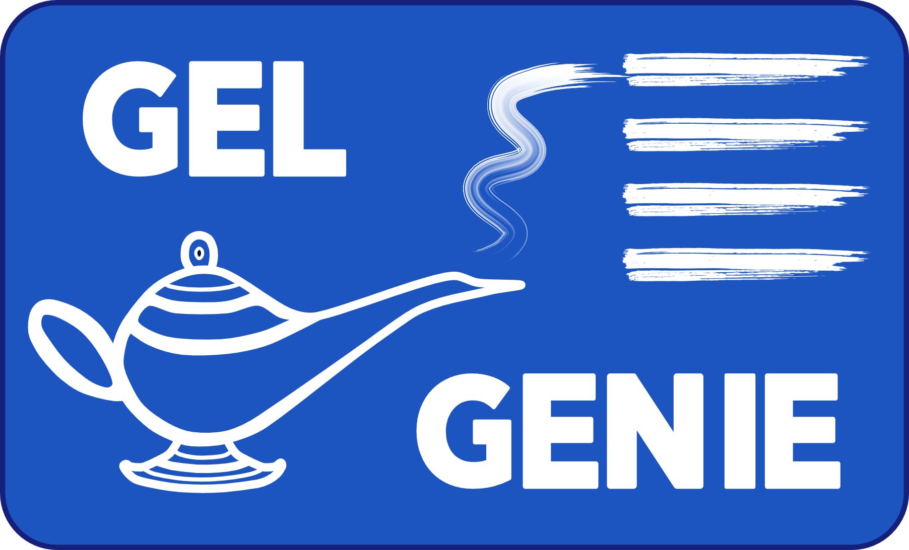

GelGenie
==============================

  

Repo containing 1) a python package for training and evaluating gel image segmentation models, 2) a QuPath plugin to use these models directly in QuPath and 3) a prototype Electron GUI for segmenting gel images using classical watershed segmentation.

Full Description TBD

- Python model training and analysis located in `./gelgenie`
- Qupath Extension code located in `./qupath-gelgenie`
- Some initial tests for using QuPath to label gel images are located in `./Semi-Auto Labelling`
- Electron GUI located in `./prototype_frontend`
- Rough scripts and data located in `./scratch`

Setting up GelGenie Environment
==============================
To install Python package run the following command from the home directory:

`pip install -e .`

Package requirements and installation details coming soon.
